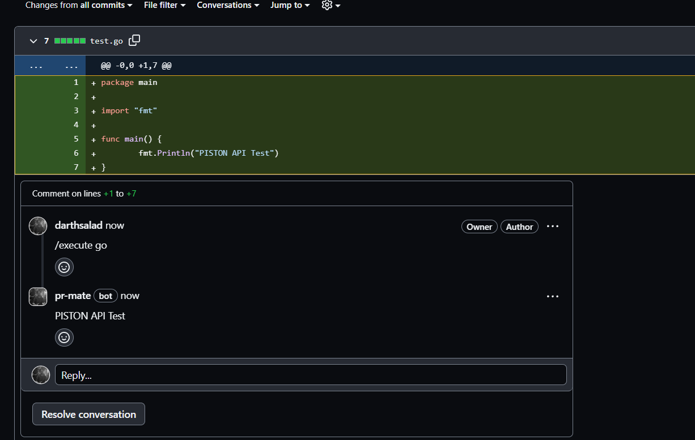
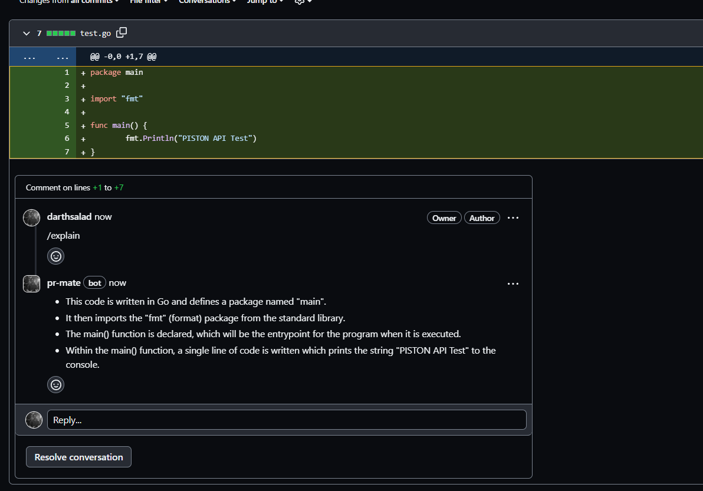

# pr-mate
> A GitHub App built with [Probot](https://github.com/probot/probot)

## Description
`pr-mate` is a GitHub App designed to enhance your pull request experience by providing real-time code execution and explanation. It listens to pull request creation events and responds with comments based on specific commands.

## Features
- ### Code Execution: 
  The app can execute code in a variety of languages using the Piston API. The output is then posted as a comment on the pull request.
- ### Code Explanation: 
  The app can provide a detailed explanation of the code using the OpenAI API. The explanation is then posted as a comment on the pull request.

## Usage
In a pull request, type the following commands in a comment:

- `/execute <language>` Replace <language> with the programming language your code is written in. It gives the output of the code that the comment is based on.
- `/explain` It gives the explanation of the code the comment is based on.

## Setup

- ### Clone the repo:
  `git clone https://github.com/darthsalad/pr-mate.git`
- `cd pr-mate`
- ### Environment Variables:
  Setup the environment variables as described in the [this file](./.env.example) section. (Most of the fields are populated by following the initial steps to setup the Probot app)
- ### Run the app
  - `yarn install` to install the dependencies
  - `yarn build` to build the app
  - `yarn start` to start the app 

## Screenshots 
- ### `/execute <language>`
  
- ### `/explain`
  

## References
- [GitHub REST API](https://docs.github.com/en/rest)
- [Piston API](https://piston.readthedocs.io/en/latest/api-v2/)
- [OpenAI API](https://beta.openai.com/docs/introduction)

## Working Demo
<video height="380" controls>
  <source src="./assets/working-demo.mkv" type="video/mkv">
</video>

## Author
- [darthsalad](https://github.com/darthsalad)

## Contributing

If you have suggestions for how pr-mate could be improved, or want to report a bug, open an issue! We'd love all and any contributions.

For more, check out the [Contributing Guide](CONTRIBUTING.md).

## License

[ISC](LICENSE) © 2023 darthsalad
